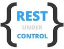

About RestControl
---
RestControl is modern and powerful framework for testing REST services. RestControl provides set of tools for describing HTTP requests and responses in expressive and elegant way.


[](https://packagist.org/packages/rest-control/rest-control)
[](https://packagist.org/packages/rest-control/rest-control)
[](https://packagist.org/packages/rest-control/rest-control)
[](https://ci.appveyor.com/project/kamszel/rest-control)
[](https://travis-ci.org/rest-control/rest-control)

Examples
---

Here's an simple example of how to make a GET request and validate json response:

```php
    /**
     * @test(
     *     title="Example test",
     *     description="Example test description",
     *     tags="find user"
     * )
     */
    public function exampleFindUser()
    {
        return $this->send()
                    ->get('https://jsonplaceholder.typicode.com/users/1')
                    ->expectedResponse()
                    ->json()
                    ->jsonPath('address.street', $this->endsWith('Light'));
    }

```
Quick Start
---
The best way for quick start is RestControl standalone application. You can find it here [https://github.com/rest-control/standalone-testing-application](https://github.com/rest-control/standalone-testing-application).
If you don't have installed all needed dependencies for project on your locally machine, you can use virtual environment from [Docker](https://docker.com/). You'll need for this [Docker](https://docs.docker.com/install/) and [Docker Compose](https://docs.docker.com/compose/) in version >= 2.1.

```
user@user:~/projects/standalone-testing-application$ make build
user@user:~/projects/standalone-testing-application$ make start
```
Now, you can use Docker machine and run example tests.

```
user@user:~/projects/standalone-testing-application$ docker exec -it restcontrol_cli_1 bash
user@machineid:/app# php vendor/bin/rest-control run
```

Contributing
---
Thank you if you considering contributing to RestControl! The contribution guide will be available soon.


Project roadmap
---
#### v0.2.0-alpha (Planned release day: 17.02.2018)
 * [x] Simple statistic collector for TestCase
 * [x] HasItem response filter and response items definition
 * [x] Implementations of validation adapters(date, email, float, hostname, iban, int, ip, isbn, length, notEmpty, numeric, regex, string, uri, uuid)
 * [x] New layout of run tests command ouput
 * [x] Fixes for CI scripts
 * [ ] More examples with different response filters
 * [ ] Add statistics in run tests command summary

[More information on Wiki page...](https://github.com/rest-control/rest-control/wiki/Roadmap)

Learning RestControl
---
RestControl documentation is under construction, please be patient.
Current documentation files are available on https://github.com/rest-control/docs